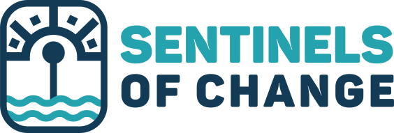

    
    &nbsp;&nbsp;&nbsp;&nbsp;&nbsp;&nbsp;
    
    &nbsp;&nbsp;&nbsp;&nbsp;&nbsp;&nbsp;
    

# sentinels-light-trap

Repository for Hakai's Sentinels of Change light trap network data

## Summary

Since 2022, a network of community partners has been monitoring larval Dungeness crab (Metacarcinus magister) using light traps along the coast of British Columbia as part of the Hakai Institute-led Sentinels of Change project. This project aims to investigate patterns of larval dispersal, population and recruitment dynamics, and whether larval abundance can serve as a tool for managers to forecast adult crab abundance years in advance. Initially inspired by the Pacific Northwest Crab Research Group (PCRG), the project works collaboratively with a diverse network of community partners, of which a full list can be found on the Sentinels of Change website. See the [master reference station list](data/Master_Stations.csv) for a the exact location of the different partners.

## Methods

From April 15th to September 1st light traps are deployed off floating docks across coastal communities around British Columbia. The trap lights turn on every night between sunset and sunrise and are checked every two days by community partners. The number of Dungeness crab megalopae and first juvenile instars are counted and photos are taken to measure larvae using an image analysis software. Partners submit data via a digital form that is promptly QCed for instant feedback. Each light trap has a corresponding HOBO Onset TidbiT MX2203 temperature loggers that are deployed near the trap at 0.5m depth. The loggers are programmed to record water temperature every 10 minutes during the entire sampling season.

## Resources

See the [data dictionary](docs/data-dictionary.csv) for a complete description of data variables, units and descriptions.

- Data Management Plan: https://doi.org/10.48321/D14FA6A58E
- Sentinels Website: https://sentinels.hakai.org/
- Pacific Northwest Crab Research Group (PCRG) website: https://www.pnwcrab.com/
- Protocol:
  - [2024 Light Trap Protocols](docs/2024%20Light%20Trap%20Protocols.pdf)
- Annual reports:
  - [2022 Sentinels of Change Light Trap Report](docs/2022%20Sentinels%20of%20Change%20Light%20Trap%20Report.pdf)
  - [2023 Sentinels of Change Light Trap Report](docs/2023%20Sentinels%20of%20Change%20Light%20Trap%20Report.pdf)

## Data Accessibility

Data in this repository includes Dungeness crab (Metacarcinus magister) megalopae count and measurement data from Sentinels of Change light trap network sites collected from April 15 - Sept 1st during 2022, 2023, and 2024. 
Additional data my be available upon request through emailing sentinels@hakai.org

## Size Data

Some entries in the Dungeness crab carapace width dataset (Master_QAQC_CarapaceWidth_Measurements_publicrepository.csv) do not have a corresponding count value for that site and date in the published OBIS records. This is due to sampling and equipment errors which resulted in certain count data being excluded from the dataset published here. See the Merge&QC_Code.R script to see how entries are excluded and the Master_QAQC_LightTrap_Counts_publicrepository.csv to see associated error codes listed in the Error_code column. 

